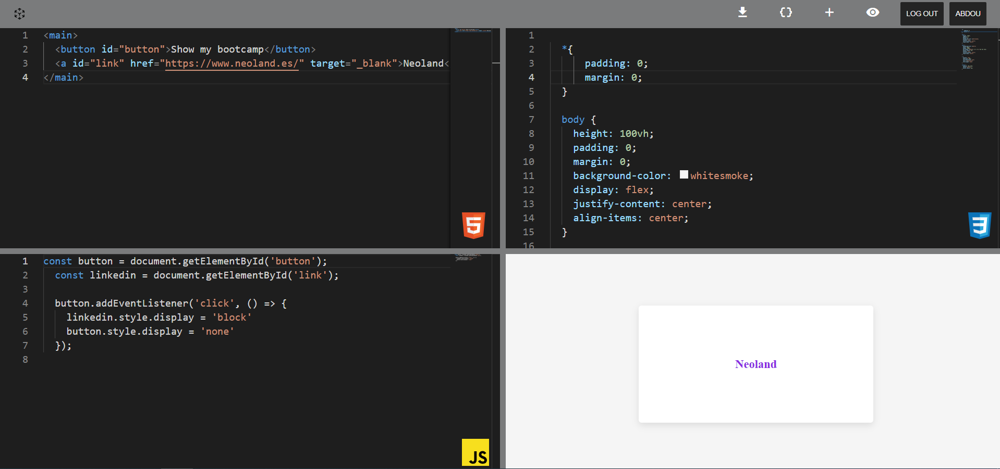
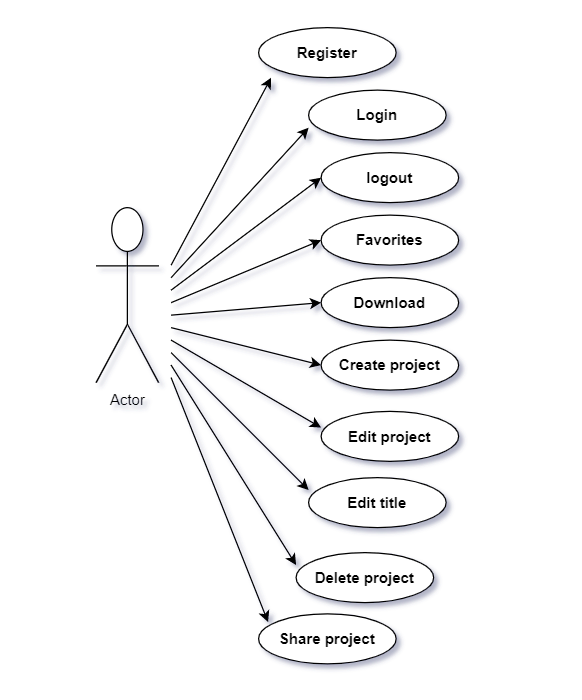
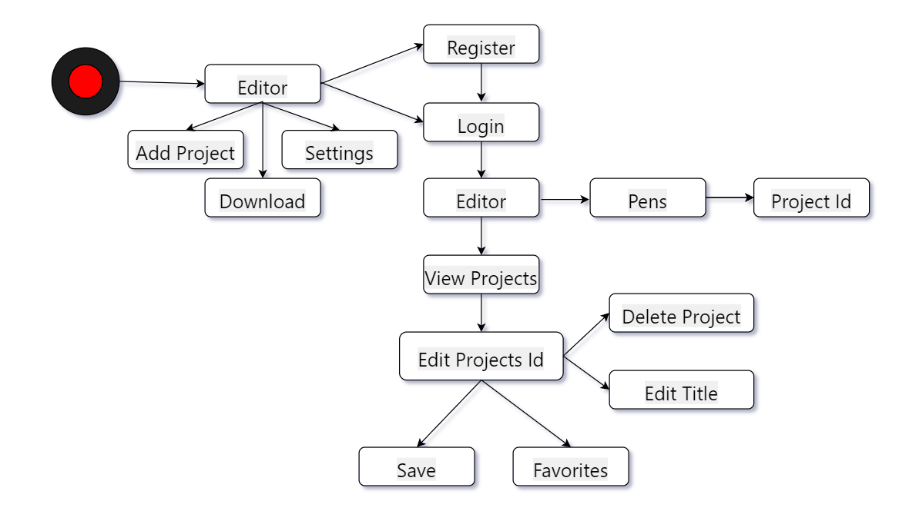
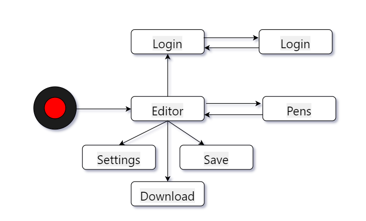
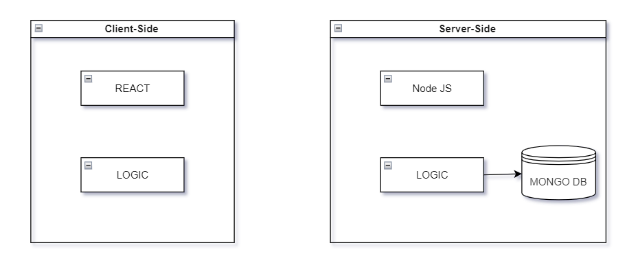
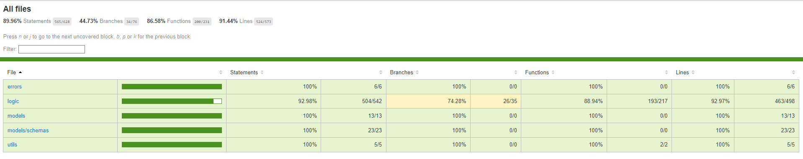
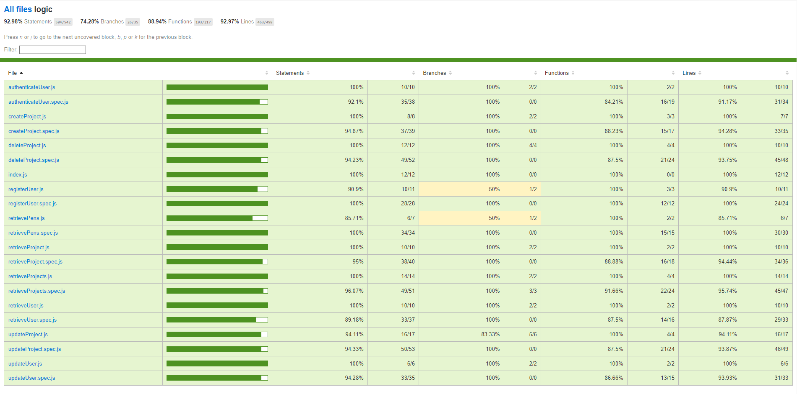

# CodePen

## Intro

Bienvenidos a mi nuevo proyecto donde pongo en práctica los conocimientos que he adquirido durante el Bootcamp. Ha sido un viaje muy desafiante pero me siento muy orgulloso del trabajo realizado.

El proyecto es una replica de Codepen con mis propia implementaciones y funciones, que te permite escribir codigo [HTML, CSS, JS] obteniendo resultado a tiempo real. La idea del proyecto es compartir codigo entre los usuarios.

También permite descargar el código escrito en un formato zip, y personalizar la configuración del editor.

## Funcional Description

- Crear un proyecto [HTML - JS - CSS].
- Descargar el proyecto en formato zip.
- Custumizar la configuración del editor.
  - Cambiar el tamaño de la fuente (FontSize).
  - Añadir o eliminar el Minimapa.
  - Añadir o eliminar el Número de líneas.
  - Cambiar el tema de los del editor (Colores).
- Ver proyectos.
- Eliminar proyecto.
- Editar proyecto.
- Editar el título del proyecto.
- Añadir favoritos al proyecto.
- Ver los proyectos de otros usuarios.
- Entrar en los proyectos de otros usuarios.

### Use Cases

## Workflow

### User

### Guest

## Technical Description
## Blocks

### Data Model

#### User

- id (ObjectId)
- username (String)
- name (String)
- email (String)
- password (String)
- favProjects ([ObjectId (Project)])

#### Project

- id (ObjectId)
- user (ObjectId)
- title (String)
- description (String)
- files [File]

#### File

- id (ObjectId)
- text (String)
- type (String, enum ['html', 'css', 'js'])

#### File

