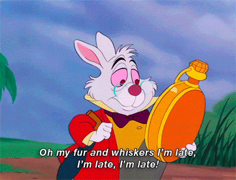

# Control Z

## Introducción

App de Control de trabajadores y tareas a realizar.

Está diseñada para resolver la comunicación entre trabajador y sus tareas a realizar, poder llevar el seguimiento de las tareas a realizar, ver el tiempo que se invertido en una tarea y llevar el control de la asistencia de los trabajadores.

## Descripción Funcional

### Casos de uso

| Admin                                  | Trabjador                           |
| -------------------------------------- | ----------------------------------- |
| Crear Usuarios Admin o Trabajador      | Ver Listado de las Tareas asignadas |
| Eliminiar Usuarios Admin o Trabajador  | Dar Reporte de acontecimientos      |
| Editar Usuarios Admin o Trabajador     | Finalizar Tareas                    |
| Crear Trabajos Nuevos                  | Pausar Tareas                       |
| Editar Trabajos Nuevos                 | Fichaje Entrada                     |
| Eliminar Trabajos Nuevos               | Fichaje Salida                      |
| Asignar Trabjador a Trabajos           |
| Editar Trabjadores a Trabajos          |
| Ver Listado de Trabajos en Procesos    |
| Ver Listado de Trabajos en Finalizados |

## Descripción Técnica

### Modelo de Datos

#### User

- id (ObjectId)
- role (String, enum ['admin', 'worker'])
- name
- username
- password
- nid (String)
- email
- date (Date)

#### Job

- id (ObjectId)
- title
- description
- address
- duration (Number)
- workers (ObjectId (User))

#### Clock

- id (ObjectId)
- user (ObjectId (User))
- job (ObjectId, (Job))
- timein (Date)
- timeout (Date)

#### Report

- id (ObjectId)
- user (ObjectId)
- job (ObjectId)
- title
- cause
- description
- date (Date)

## TODOs

- TODO completar documentacion, diagramas con las modificacion (README.md)
- TODO Agregar figma correspondiente
- TODO finalizar testing logic server side
- TODO implementar reports
- TODO implementar pausas de trabajos (boton pause)
- TODO remake toast styles
- TODO implementar mas estilos
