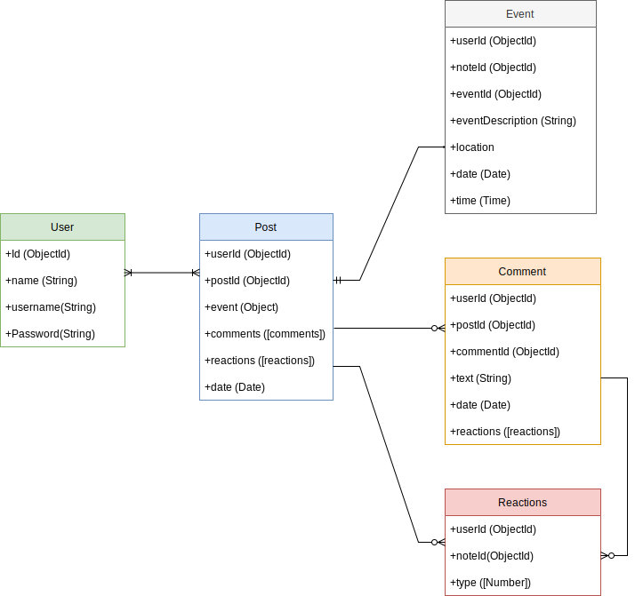

# BEACH SPACE
 
## Intro

Beach space permite a sus miembros reunirse en la vida real via grupos unidos por un interés común​ que en este caso, es conectarse con personas apasinadas por la playa y todas sus interaccones tal como: el surf, paddle surf, beachvoley, natación, footvoley, además, organizar eventos para limpieza de playa, competiciones, etc.

## Functional Description

### Use Cases

- add events
- update events
- remove eventos
- subcriber on events publication
- unsubcribe on events publication
- comment on the event publication
- update comments on the event publication
- remove comments from the event publication

### Wireframes

## Technical Description

### Data Model

#### User
- id (ObjectId)
- name (String)
- usermame (String)
- password (String)

#### Post
- id (ObjectId)
- user (ObjectId)
- event (Oject)
- comments ([Comment])
- reactions ([Reactions])
- date (Date)

#### Event
- Id (ObjectId)
- user (ObjectId)
- note(ObjectId)
- description(String)
- location
- date (Date)
- time (Time)

#### Comment
- Id (ObjectId)
- user(ObjectId)
- post(ObjectId)
- text (String)
- date (Date)
- reactions ([Reactions])

#### Reaction
- Id (ObjectId)
- user (ObjectId)
- post (ObjectId)
- text (String)
- date (Date)
- reactions ([Reactions])

