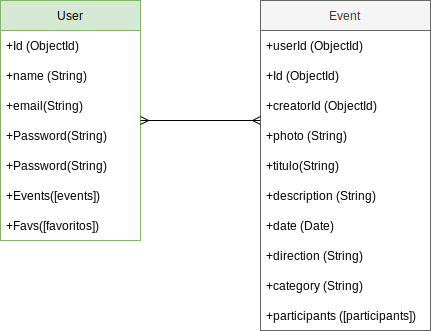

# BEACH SPACE
 
## Intro

Beach space permite a sus miembros reunirse en la vida real via grupos unidos por un interés común​ que en este caso, conectarse con personas apasionadas por la playa y todas sus interaccones tal como: el surf, paddle surf, beachvoley, natación, footvoley, además, organizar eventos para limpieza de playa, competiciones, after works, etc.

## Functional Description

### Use Cases

- add events
- update events
- remove eventos
- subcriber on events publication
- unsubcribe on events publication

### Wireframes

## Technical Description

### Data Model

#### User
- id (ObjectId)
- name (String)
- usermame (String)
- email (String)
- password (String)
- events([Events])
- favorites([Favorites])

#### Event
- user (ObjectId)
- Id (ObjectId)
- creatorId(ObjectId)
- photo(String)
- title(String)
- description(String)
- date (Date)
- direction(String)
- category(String)
- participants([Participants])

