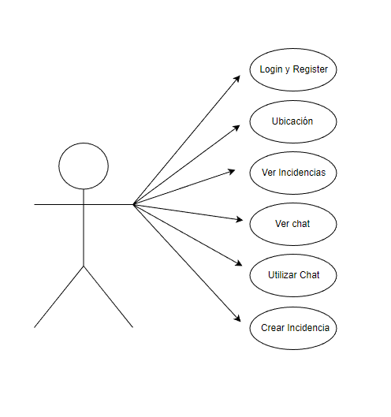
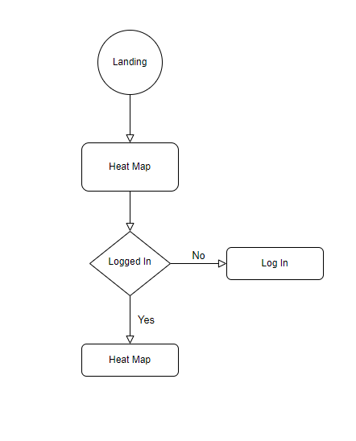
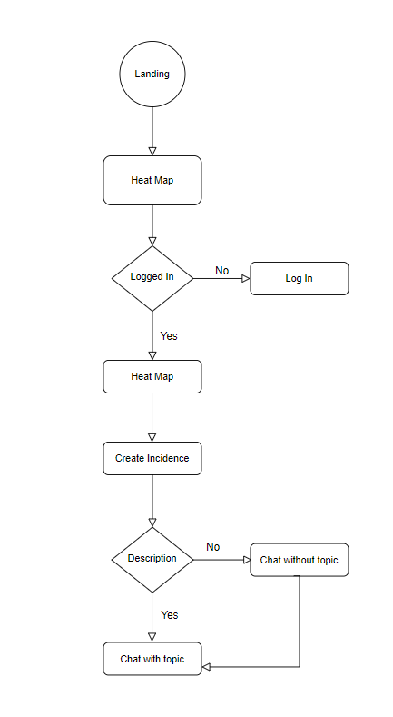
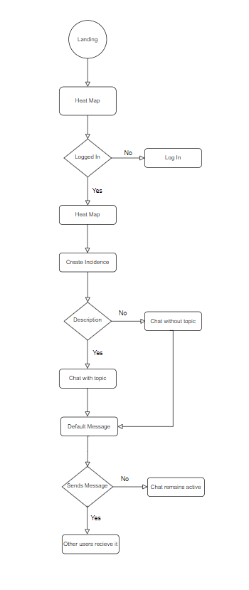
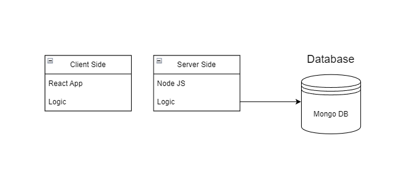

## Safetyium

## Intro

Safetyium es una aplicación cuyo objetivo es mantenerte seguro allí donde vas permitiendote pedir ayuda y interactuar con otros usuarios en cualquier momento de posible peligro.

## Funcional Description

- Landing
- Login y Register
- Ver Ubicacion actual 
- Ver incidencias de otros usuarios
- Crear Incidencias
- Chat de las incidencias
- Ver historial del chat y interactuar

### Use Cases

## Flow Charts

Watch other users incidences

Create Incidence

Incidence Chat

## Technical Description

### Blocks

### Data Model

#### User
- id: (ObjectId)
- username: (String)
- name: (String)
- password: (String)

#### Message
- id (ObjectId)
- user (ObjectId)
- text (String)

#### Incidence

- id: (ObjectId)
- user: (ObjectId) userid
- altitude (String)
- longitude (String)
- description

## Technologies

- Javascript
- React
- CSS
- SASS
- HTML
- Express
- Mongo
- Node

