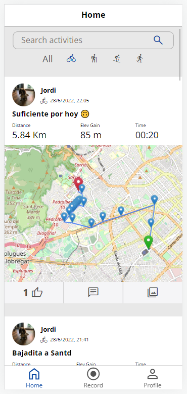
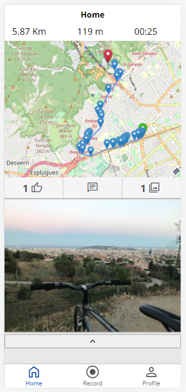
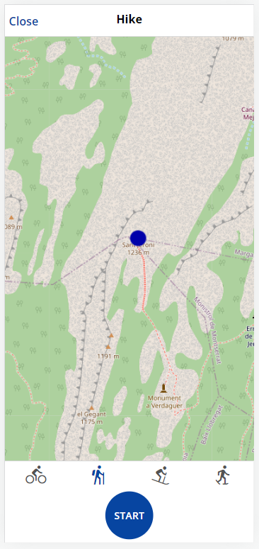
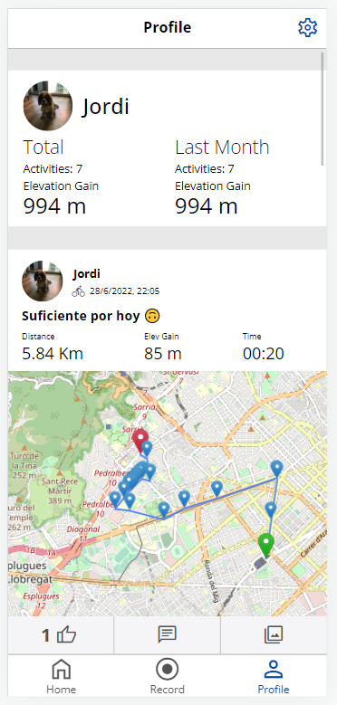
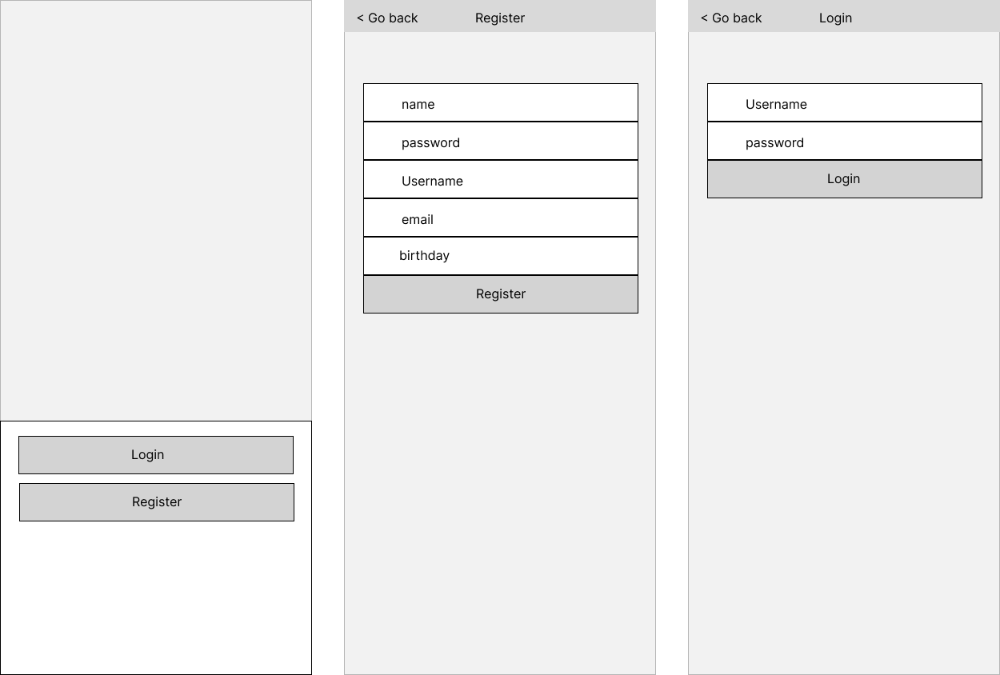
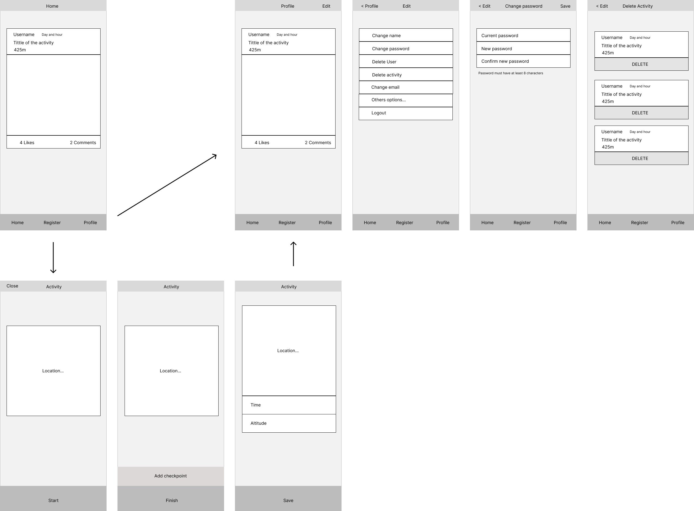
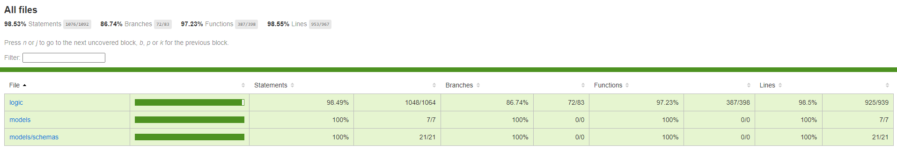
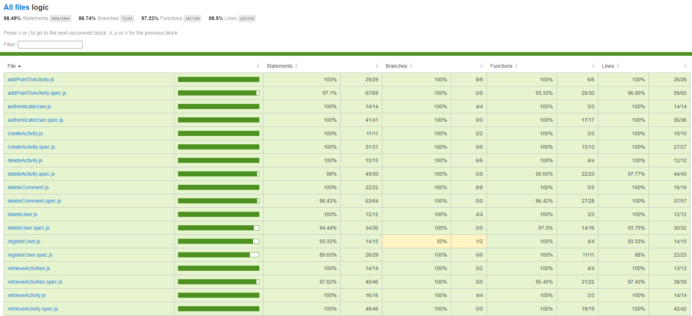
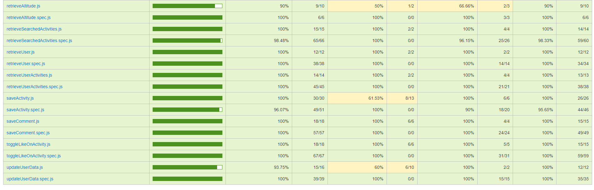

# Stravita
Strava a manita

## Intro

This **Application** is designed to record different mountain activities with the main focus on altitude and distance from start point to finish.

It is a social network where users can comment and like each other's activities.

||

||

## Functional Description

### Use Cases

- Record an activity
    - record diferents positions and altitude
    - show live data (distance, time, elevation, points in map)
    - save sport, dificult, text and photos
    - hide button to record points automaticaly
- Resume activities made within the last 6 hours
    - upload new o diferent information if its needed
- List activities from all users
    - Like activities
    - Comment activities
- Seach activities
    - search for title (with or without capital letters)
    - filter for sport
- List your activities
    - including a sumary of your total and last month data
    - including private activities
- Change your information 
    - name, email, password
    - update personal Foto (one default)
    - delete activities
    - delete user

### Wireframes

[Figma url]: https://www.figma.com/file/haWT288GikgqrQmxQphSnj/Project?node-id=0%3A1

[Figma url]

#
## Technical Description

The user can record points during the activity, once they click the start button the first point is recorded and shown on the map, the next points could be recorded with the record button, and again with the finish button, one last point is also recorded.

There is a hide possibility to record automatically for every new found position
To use this function user have to click 6 times in the upper right corner, and one button will appear.

Once the user completes the activity the title is required, other inputs are optional and the sport can be changed again or maintain the first selection.

If the activity stops in the middle of the process it will be saved as a private, but if it ends with the correct process, and user does not select anything, by default will be public.

User will be able to resume activities in his personal profile within the last 6 hours, the activity will be opened with all the points and data saved

User can change profile Foto in settings, there is a default Foto for new users registered

Activities can be deleted in personal profile -> settings -> delete activities

## Technologies
- React
- JavaScript
- Node JS
- MongoDB

### Data Model
User, Activity, Point, Comment

#### User
- id (ObjectId)
- name (String)
- usermame (String)
- password (String)
- email (String)
- foto (String)

#### Activity
- id (ObjectId)
- user (ObjectId)
- title (String)
- text (String)
- date (Date)
- sport (String)
- dificult (String)
- private (Boolean)
- points ([point])
- comments ([comment])
- likes ([UserId])
- images ([String])

#### Point
- id (ObjectId)
- altitude (Number)
- latitude (Number)
- longitude (Number)
- time (Date)

#### Comment
- id (ObjectId)
- user (ObjectId)
- text (String)
- date (Date)

### Testing
 - Mocha - Chai

