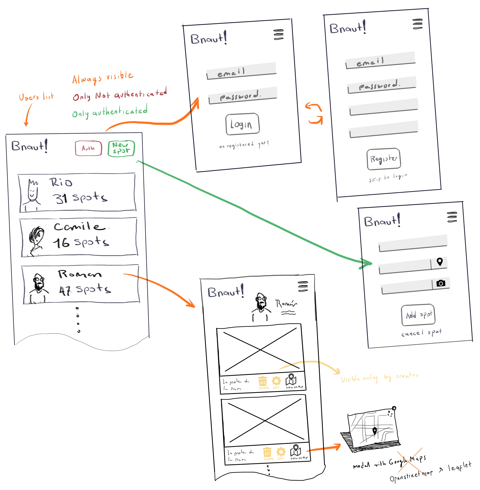
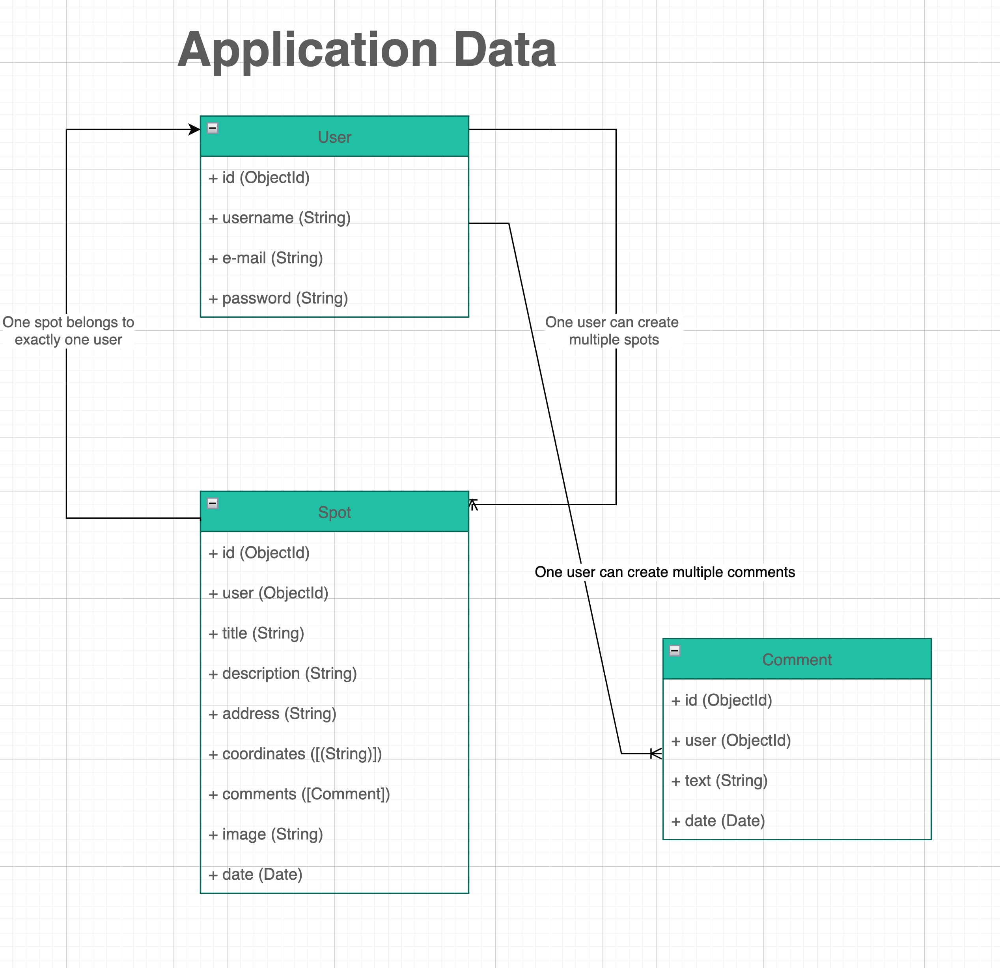
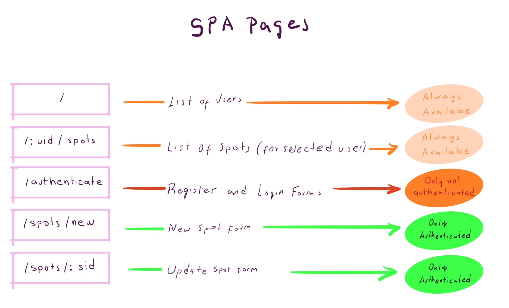
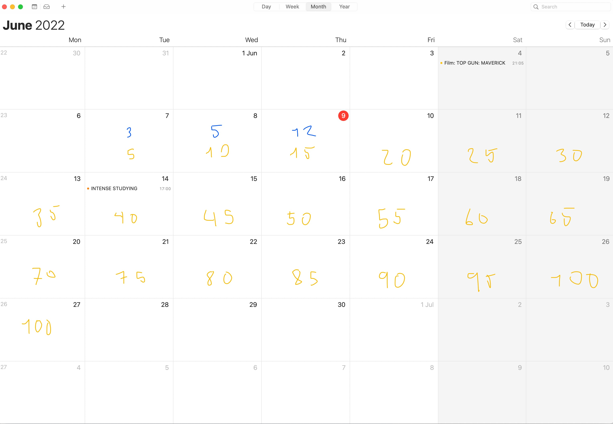

# APP: BNautas!

## Intro

Community of Barcelonans who occasionally go on urban 
treks to discover unexplored corners of the city that stand out 
for their beauty, rarity or some particularity that they consider special. 
Through BNautas! you can record those finds and also share them with other Bnauts!

## Functional Description

### Use Cases

- Add Spot
- List Spots
- Edit Spot
- See user Spots
- Comment user Spot

### Wireframes

## Technical Description
Bnauts! allows to share places of Barcelona City. 
That means user can posts a new place called "spot". 
Each spot has a photography and a location. Creating new spot is only available for registered users. 
Create a new spot requires three actions: 
1. to upload a picture from a disk, 
2. type an address using a form input. 
3. to label or named this spot and agregate an excerpt. 

 Also user can list other users content. If user is authenticated also can leave comments to any other user's spot
### Data Model
#### User
- id (ObjectId)
- email (string)
- password (String)

#### Spot
- id (ObjectId)
- user (ObjectId)
- title (String)
- description (String)
- address (String)
- coordinates ([Number, Number])
- comments ([Comment])
- image (String)
- date (Date)

#### Comment
- id (ObjectId)
- user (ObjectId)
- text (String)
- date (Date)

#### Timeline progress
pwd