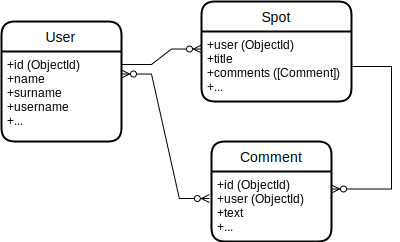

# My App

## Intro

blah blah blah

## Functional Description

### Use Cases

TODO list use cases

- Add Spot
- Search Spots
- Edit Spot
- See user Spots
- ...

### Wireframes

TODO show wireframes (screens) images

## Technical Description

...

### Data Model

TODO list data entities

#### User
- id (ObjectId)
- name (String)
- surname (String)
- age (Number)
- usermame (String)
- password (String)

#### Spot
- id (ObjectId)
- user (ObjectId)
- title (String)
- comments ([Comment])
- ...

#### Comment
- id (ObjectId)
- user (ObjectId)
- text (String)
- date (Date)
- ...

