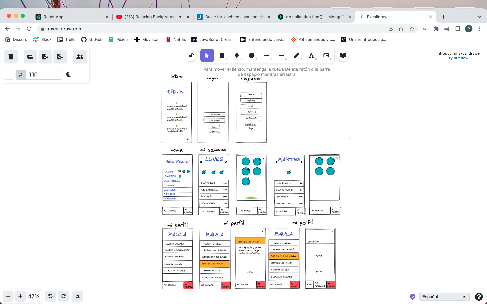

# Mi buzón del pan

## Intro

Servicio de entrega de pan y pastas artesanales recién hechas a la puerta de tu casa.
Nuestros clientes recibirán cada día de la semana durante la mañana, el pan y las pastas que hayan decidido
Solamente debe suscribirse por 20€ mensuales. Nuestro equipo instalará un buzón en su vivienda y recibirá nuestros productos

### Use Cases

- suscribirse
- elegir panes según el tipo y dia de la semana
- ver su pedido semanal
- cambiar su pedido semanal
- añadiendo o eliminando productos y cambiar su información personal.

### Wireframes

## Technical Description

...

### Data Model

TODO list data entities

#### User
- id (ObjectId)
- name (String)
- usermame (String)
- email (String)
- password (String)
- Address (String)

#### Schedule
- id (ObjectId)
- user (ObjectId)
- monday: [item],
- tuesday: [item],
- wednesday: [item],
- thursday: [item],
- friday: [item],
- saturday: [item],
- sunday: [item]

#### Product
- tytle: String
- type (Number, enum: [0 /* pan blanco */, 1 /* pan integral */, 2 /* pan de variedades */, 3 /* bolleria */, 4 /* sin gluten */, ],)
- imagen: String

#### Item
- product: (ObjectId)
- quantity: Number

